Abstract
========

This experiment use Indri-5.18 to run the 50 TREC queries against WT2G
collection, and evaluate the returned ranked list. The implemented
ranking functions containing vector space model(Okapi TF $\times$ IDF),
language model and some smoothing functions. Besides tuning ranking
functions, I also modify the queries according to the TREC queries
description and narrative.

This report will be divided into four part. In part one, I will
introduce the environmental setups and compare 2 types of indexing
methods, whether to use stemming and then whether to use stop words
filtering. After choosing proper indexing method, I will discuss the
impact of query types by running 3 different types of queries under same
indexing method and ranking function. After comparing query types and
indexing methods, this report will compare the result of different
ranking functions to see which one of the ranking functions performs the
best. For the final part, there will be the comparison among all
settable parameters’ combinations, to verify the assumption made by
previous parts or determine which set of parameters’ combination is
suitable for what situation.

Experiment Setup and Indexing Methods Comparison {#section:2}
================================================

This section will introduce the basic setups of the experiment,
including environmental setup, parameters setup when building index, and
introduce the differences and parameters in running queries between
different cases.

Environmental Setup Steps and File Trees
----------------------------------------

The operating system used is macOS Mojave 10.14.6. After downloading
Indri-5.18, install `gcc@6` through Homebrew. Then configure Indri
project, modify `MakeDefns` and `atomic.hpp` file. After modifying these
settings, run make install to install Indri to system.

The following shows the file tree of this experiment:

Like the file tree shows, there are 4 different indexing methods,
including normal indexing, indexing with stop words filtering, indexing
with stemmer, indexing with stemmer and stop words filtering.

Indexing Methods Comparison
---------------------------

### The Impact of Stemming

In this part of experiment, I run the 50 TREC queries’ title as query
against WT2G collection with Okapi, Language Model(LM) and LM with JM
smoothing function(LMJM) respectively, using both no stemming indexing
and stemming indexing.

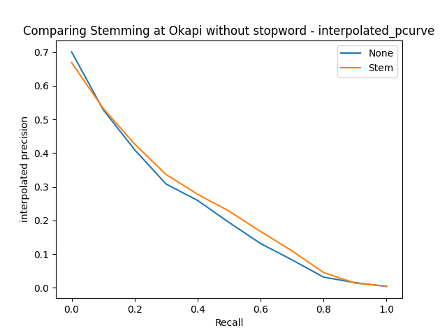
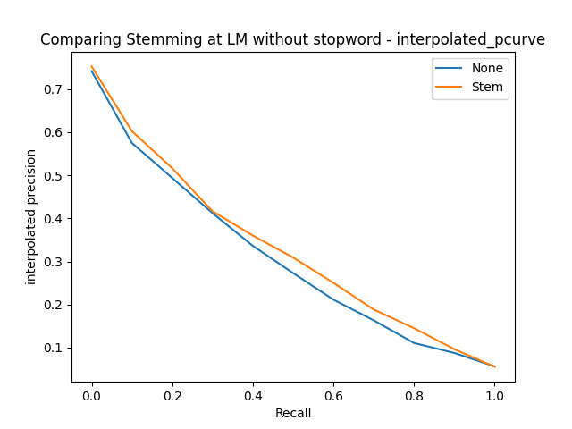

[fig:stemming~i~]

In Figure [fig:stemming~i~], we can observe that the precision without
stemming indexing(blue line) is slightly higher than the precision with
stemming indexing(orange line) at 0.1 recall level in both Okapi’s and
LMJM’s cases. However, after 0.1 recall level, the precision with
stemming indexing is stably higher than that of no stemming indexing
result in Okapi’s case. Furthermore, the precision with stemming
indexing is also higher than precision of no stemming indexing at any
recall level in LM’s case. As for the LMJM’s case, the two results of
precision remains the same(with slight difference) at any recall level
after 0.1.

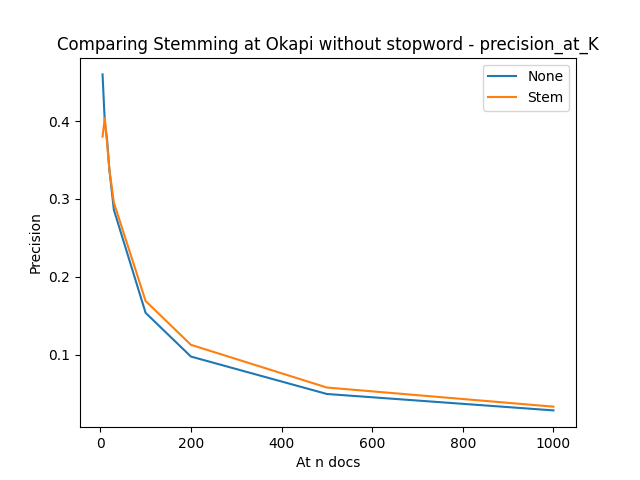
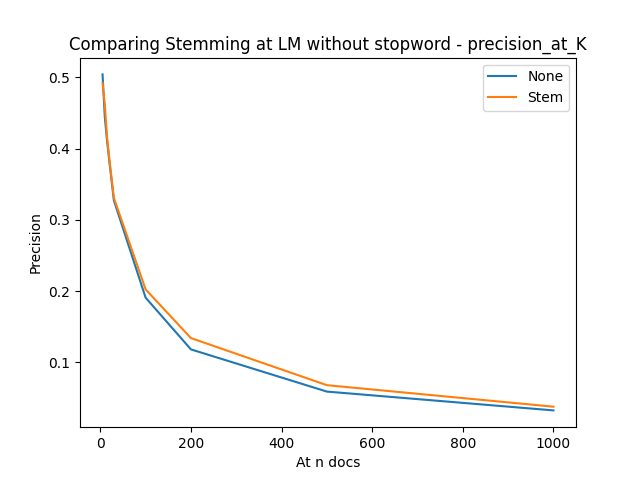

[fig:stemming~p~]

Figure [fig:stemming~p~] shows the same result. Although the precision
without stemming indexing is higher than that with stemming indexing in
Okapi’s case at first 5 documents, the precision with stemming indexing
is slightly higher in most situation. Therefore, the retrieval system
without stemming indexing is suitable for users who only care about
first few retrieved results, while the retrieval system with stemming
indexing is suitable for users who seeking for big amount of results,
for the overall performance of this kind of system is better than the
former one.

[fig:stemming~f~]

Figure [fig:stemming~f~] shows the F1 score under these two kinds of
indexing method among three different cases. As we can see, the F1 score
is better with stemming indexing than those without stemming indexing in
all of the three cases.

In conclusion, with the help of stemming functions, the system could
generalize and recognize more words more generally than the system
without stemming. Consequently, the stemming system performs better than
the system without stemming indexing.

### The Impact of Stop Words Filtering

After measuring the importance of stemming indexing, this section will
verify the impact of stop words filtering, to see if indexing with stop
words filtering improves the system performance.

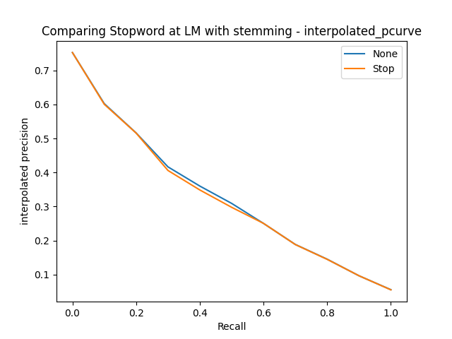

[fig:stop~i~]

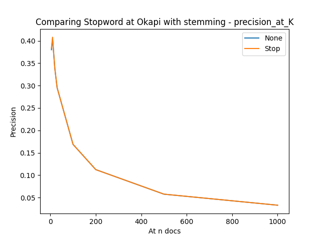
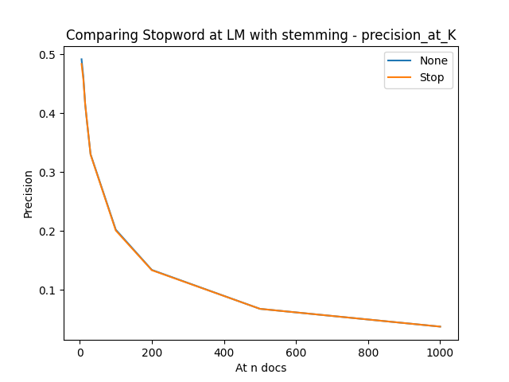

[fig:stop~p~]

[fig:stop~f~]

In both of Figure [fig:stop~i~] and Figure [fig:stop~p~], the result
precision of stop words filtering and no stop words filtering have
almost no difference in both interpolated precision curve and precision
at k curve. The only difference between the precision of these two
indexing method(with/without stop words filtering) is in LM’s case,
where the precision of no stop words filtering indexing at about 0.2 to
0.6 recall level is slightly greater than those with stop words
filtering in the interpolated precision curve. In the precision at k
curve, there is merely no difference between two indexing methods. For
this circumstance, I think the reason why systems perform very similarly
is that the IDF function works similar to stop words filtering, and each
one of these three ranking methods contains functions that works similar
to IDF function, which causes both the system with and without stop
words filtering show similar result.

In Figure [fig:stop~f~], however, the F1 score shows that the
performance of no stop words filtering is slightly better than those
with stop words filtering. Therefore, in the following experiments, the
indexing methods will be “indexing with stemming but without stop words
filtering”

Query Types Comparison {#section:3}
======================

After determining the parameters of indexing method, this section will
discuss the impact of different type of queries. There are 3 types of
queries in this section, which are “Normal”, “Description” and
“Description with title”.

In the Normal’s case, the queries used for retrieving documents only
contains contents of the title tag in the TREC queries. As for the
Description case, the queries for retrieval contains the descriptions
tag’s content, with stop words removal. Finally, the Description with
title’s case’s queries combine the previous two cases, which means the
queries of this case contain queries’ title and description(with stop
words filtering) from TREC queries.

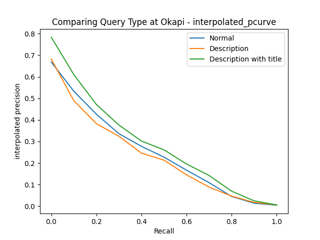
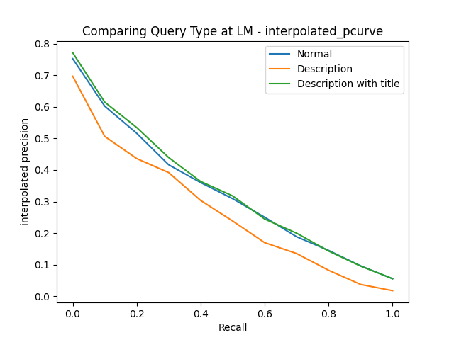

[fig:q~i~]

In Figure [fig:q~i~], we can see that the green curve(Description with
title’s case) outperform the other two curves under both Okapi and LMJM
ranking functions, and the blue curve(Normal’s case) performs similar to
green curve under LM ranking function. The Description’s case performs
the worst among these three different query type.

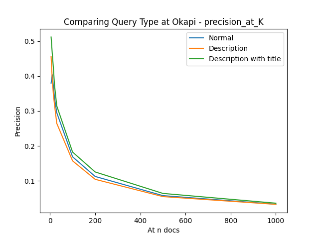
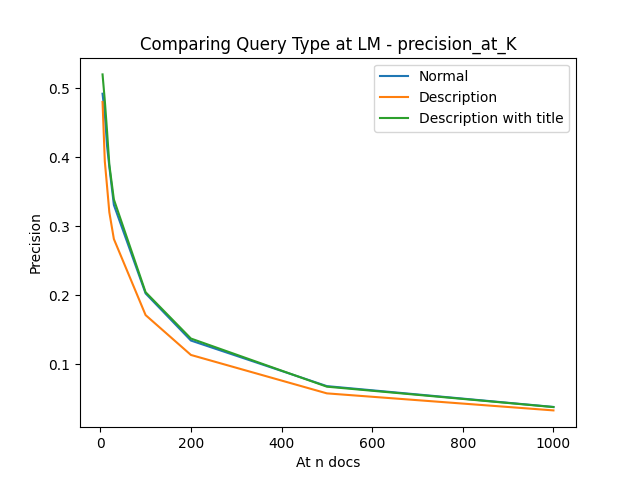

[fig:q~p~]

[fig:q~f~]

Figure [fig:q~p~] shows the same result. Although these three curves are
very close to each other, we still can observe that the orange
curve(Description’s case) is in the leftmost of the figure, and the
green curve(Description with title’s case) always lies in the rightmost
of the figure. To observe in a more general viewpoint, Figure [fig:q~f~]
shows that the F1 of Description with title’s case is higher than that
of other two cases under every ranking functions.

There are two possible drawbacks of other two cases so that the
Description with title case perform better than the other two cases. The
first is that the Normal case contains too little information about the
information needed by user. Another drawback for Description case is the
content in description might not be specific enough for system to
retrieve corresponding documents. However, the Description with title
case combine title and description to make the query more specific and
contains more hints about the information needs. Therefore, due to the
better performance of the Description with title case, the query types
used to measure ranking functions will be “Description with title” in
the following sections.

Ranking Functions Comparison {#section:4}
============================

Comparing Okapi, LM and LMJM
----------------------------

This section will discuss the performance of required 3 different
ranking functions, including Okapi, Language Model and Language Model
with JM smoothing function, to determine which one of these functions
performs the best.

[fig:r~i~p]

According to the interpolated precision curve showed in Figure
[fig:r~i~p], the orange curve(LM case) possesses the highest precision
at any given recall level and any amount of document retrieved in
precision at k curve. As for other two cases, the Okapi function(blue
curve) has higher precision at anterior results and close to the
performance of LM system in both figure in Figure [fig:r~i~p] which
makes it suitable for users who focus on top results. Furthermore, the
performance of Okapi function even surpass that of LM function in the
Interpolated precision curve before 0.1 recall level. However, the LMJM
function performs not very well in the both graph in Figure [fig:r~i~p].
The precision of LMJM case only surpass Okapi’s after 0.7 recall level,
making the overall results retrieved by LMJM might be slightly better
than Okapi’s overall results.

[fig:r~f~]

Figure [fig:r~f~] shows the same results. LM case’s F1 score is
obviously higher than the other two ranking methods, and Okapi’s F1
score is also slightly higher than LMJM’s. The possible reason is that
the lambda of JM smoothing might not be optimal, therefore causing the
result worse than the LM without JM smoothing one. Additionally, we can
see that the performance of query generation(language model) is better
than the performance of document generation(Okapi).

Add Pseudo Feedback
-------------------

After figuring out the best ranking function is LM among the basic
required 3 functions, I decided to add pseudo feedback to the LM ranking
function(LMFB) to see if the result is better than all of the three
basic required ranking functions.

[fig:fb~i~p]

As the result precision showed in Figure [fig:fb~i~p], we can see that
the LM with pseudo feedback(LMFB, red curve) performs almost the same as
the LM’s performance(orange curve), but even slightly better than LM.
Only at about 0.9 recall level does the red curve lower than the orange
curve. However, the Okapi’s performance(blue curve) is still better than
the LMFB’s before but only at 0.1 recall level. For the precision at k
curve in Figure [fig:fb~i~p], although the red curve and orange curve
are very close to each other, we can still see that red curve slightly
greater than the orange curve at 50 500 documents.

 F1 Score.png "fig:")
[fig:fb~f~]

For the F1 score of the LMFB’s case, the score is 0.0727, which is very
close to LM’s case whose score is 0.0719, which also shows that the
LMFB’s case is the best ranking function among these four ranking
methods. The possible reason is that, since the LM’s case is already the
better ranking function among the three required functions, adding the
pseudo feedback according to LM’s result to tune the result could
definitely help the system to retrieve document more precisely.

To sum up, the current best retrieval method is indexing with stemming,
query with description and title, and ranking with language model and
its pseudo feedback.

Comparing All Retrieved Results {#section:5}
===============================

In this section, I run all the possible parameters combinations, and
sort each retrieval methods in terms of F1 score, precision score,
recall score and average precision. Through the comparison in this
section, I will verify the assumptions made in previous sections are
correct or not. This section will be divided into 4 parts for each
corresponding sorting basis.

Methods Sorted by F1 score
--------------------------

 |c|c|c|c|c|c|c|c|c|c|c|  method~i~ & index & stop &
rank$\_$fn & query & f1 & precision & recall & AP\
9 & Stem & none & LM & Normal & 0.0739 & 0.0387 & 0.8293 & 0.3113\
13 & Stem & Stop & LM & Normal & 0.0738 & 0.0386 & 0.8284 & 0.3079\
47 & Stem & Stop & LMFB & q+des & 0.0735 & 0.0384 & 0.8425 & 0.3250\
15 & Stem & Stop & LMFB & Normal & 0.0731 & 0.0382 & 0.8381 & 0.3288\
43 & Stem & none & LMFB & q+des & 0.0727 & 0.0380 & 0.8328 & 0.3307\
11 & Stem & none & LMFB & Normal & 0.0727 & 0.0380 & 0.8337 & 0.3260\
41 & Stem & none & LM & q+des & 0.0719 & 0.0376 & 0.8240 & 0.3160\
45 & Stem & Stop & LM & q+des & 0.0717 & 0.0375 & 0.8227 & 0.3125\
44 & Stem & Stop & Okapi & q+des & 0.0687 & 0.0359 & 0.7872 & 0.2697\
40 & Stem & none & Okapi & q+des & 0.0687 & 0.0359 & 0.7872 & 0.2688\

|l|l|l|l|l|l|l|l|l| & &\
Stem & Stop & Okapi & LM & LMJM & LMFB & Normal & Description &
Description with title\
9 & 6 & 2 & 4 & 0 & 4 & 4 & 0 & 6\

As mentioned above, we can learn that the indexing with stemming is
important from the table above, among ten best 10 ranking methods, there
are 9 of them use stemming indexing, and the result remains the same in
the following records. However, there are two difference between this
result and the previous assumptions. For the first one difference, in
the perspective of F1 score, the LM ranking function performs slightly
better than the LMFB ranking method, but the Okapi ranking function
remains the same performance. For the second difference, the best few
methods use the Normal query, but the Description with title query type
still appears more in the whole 10 best methods.

As a result, if the user requires both precision and recall score high
enough, then the system should use stemming indexing without stop words
filtering, query the collection with Normal queries, and rank the
results with LM ranking function just like method~9~.

Methods Sorted by Precision Score
---------------------------------

 |c|c|c|c|c|c|c|c|c|c|c|  method~i~ & index & stop &
rank$\_$fn & query & f1 & precision & recall & AP\
9 & Stem & none & LM & Normal & 0.0739 & 0.0387 & 0.8293 & 0.3113\
13 & Stem & Stop & LM & Normal & 0.0738 & 0.0386 & 0.8284 & 0.3079\
47 & Stem & Stop & LMFB & q+des & 0.0735 & 0.0384 & 0.8425 & 0.3250\
15 & Stem & Stop & LMFB & Normal & 0.0731 & 0.0382 & 0.8381 & 0.3288\
43 & Stem & none & LMFB & q+des & 0.0727 & 0.0380 & 0.8328 & 0.3307\
11 & Stem & none & LMFB & Normal & 0.0727 & 0.0380 & 0.8337 & 0.3260\
41 & Stem & none & LM & q+des & 0.0719 & 0.0376 & 0.8240 & 0.3160\
45 & Stem & Stop & LM & q+des & 0.0717 & 0.0375 & 0.8227 & 0.3125\
44 & Stem & Stop & Okapi & q+des & 0.0687 & 0.0359 & 0.7872 & 0.2697\
40 & Stem & none & Okapi & q+des & 0.0687 & 0.0359 & 0.7872 & 0.2688\

|l|l|l|l|l|l|l|l|l| & &\
Stem & Stop & Okapi & LM & LMJM & LMFB & Normal & Description &
Description with title\
10 & 5 & 2 & 4 & 0 & 4 & 4 & 0 & 6\

The methods sorted by precision score is similar to the result of
sorting by F1 score. It is because the F1 score will punish the lower
score between precision and recall, and the precision is much lower than
the recall score on average. Similarly, if the user requires higher
precision of the results, or the system is used in trash main filtering
etc., the system should also possess the parameters same as method~9~ as
well.

Methods Sorted by Recall Score
------------------------------

 |c|c|c|c|c|c|c|c|c|c|c|  method~i~ & index & stop &
rank$\_$fn & query & f1 & precision & recall & AP\
47 & Stem & Stop & LMFB & q+des & 0.0735 & 0.0384 & 0.8425 & 0.3250\
15 & Stem & Stop & LMFB & Normal & 0.0731 & 0.0382 & 0.8381 & 0.3288\
11 & Stem & none & LMFB & Normal & 0.0727 & 0.0380 & 0.8337 & 0.3260\
43 & Stem & none & LMFB & q+des & 0.0727 & 0.0380 & 0.8328 & 0.3307\
9 & Stem & none & LM & Normal & 0.0739 & 0.0387 & 0.8293 & 0.3113\
13 & Stem & Stop & LM & Normal & 0.0738 & 0.0386 & 0.8284 & 0.3079\
41 & Stem & none & LM & q+des & 0.0719 & 0.0376 & 0.8240 & 0.3160\
45 & Stem & Stop & LM & q+des & 0.0717 & 0.0375 & 0.8227 & 0.3125\
44 & Stem & Stop & Okapi & q+des & 0.0687 & 0.0359 & 0.7872 & 0.2697\
40 & Stem & none & Okapi & q+des & 0.0687 & 0.0359 & 0.7872 & 0.2688\

|l|l|l|l|l|l|l|l|l| & &\
Stem & Stop & Okapi & LM & LMJM & LMFB & Normal & Description &
Description with title\
10 & 5 & 2 & 4 & 0 & 4 & 4 & 0 & 6\

In the methods sorted by recall score, the best method with highest
recall value use almost the same as the assumption made in previous
sections, except for the indexing method contains stop words filtering.
All of the best 10 methods use stemming indexing in terms with recall
score, and top 4 best methods use LMFB as ranking function. Furthermore,
according to the table above, we can also determine the relationship
among the four ranking functions is LMFB $>$ LM $>$ Okapi $>$ LMJM.
Additionally, in the aspect of query types, the Description with title
case provide more stable performance than Normal case’s on average.

As a result, the best method is method$_{47}$ in terms of recall score,
which has highest recall score and third highest precision score, making
this method very suitable for searching documnets.

Methods Sorted by Average Precision Score
-----------------------------------------

 |c|c|c|c|c|c|c|c|c|c|  method~i~ & index & stop &
rank$\_$fn & query & f1 & precision & recall & AP\
43 & Stem & none & LMFB & q+des & 0.0727 & 0.0380 & 0.8328 & 0.3307\
15 & Stem & Stop & LMFB & Normal & 0.0731 & 0.0382 & 0.8381 & 0.3288\
11 & Stem & none & LMFB & Normal & 0.0727 & 0.0380 & 0.8337 & 0.3260\
47 & Stem & Stop & LMFB & q+des & 0.0735 & 0.0384 & 0.8425 & 0.3250\
39 & none & Stop & LMFB & q+des & 0.0668 & 0.0349 & 0.7657 & 0.3204\
41 & Stem & none & LM & q+des & 0.0719 & 0.0376 & 0.8240 & 0.3160\
7 & none & Stop & LMFB & Normal & 0.0662 & 0.0346 & 0.7582 & 0.3154\
45 & Stem & Stop & LM & q+des & 0.0717 & 0.0375 & 0.8227 & 0.3125\
9 & Stem & none & LM & Normal & 0.0739 & 0.0387 & 0.8293 & 0.3113\
13 & Stem & Stop & LM & Normal & 0.0738 & 0.0386 & 0.8284 & 0.3079\

|l|l|l|l|l|l|l|l|l| & &\
Stem & Stop & Okapi & LM & LMJM & LMFB & Normal & Description &
Description with title\
8 & 6 & 0 & 4 & 0 & 6 & 5 & 0 & 5\

In the perspective of average precision, the best parameter combination
method$_{43}$ use exactly the same assumption in the previous
sections(Section [section:2] through Section [section:4]). The possible
reason is that, the average precision is the indicators that reflect
global effectiveness, and I always choose the rightmost curve in the
interpolated precision curve and precision at k curve in the previous
sections. Therefore, the previous assumptions are consistent with
average precision score, showing that method$_{43}$ possess the best
performance on overall retrieval results.

Conclusion
==========

In Section [section:2], it is determined that the stemming is important
as an indexing function, but stop words filtering might not be as
necessary as stemming due to the IDF implied functions in ranking
methods. As for query types in Section [section:3], we learned that the
normal query title in TREC queries might be sufficient enough to
retrieve documents. However, with the help of the description of the
query without stop words, the result precision score increase in most of
the cases. As for the ranking functions in Section [section:4], the LM’s
function always out performance to other functions, and the results are
even better when added pseudo feedback to LM ranking function.

Through Section [section:2] to [section:4], we determined the best
retrieving function in the aspect of interpolated precision curve and
precision at k curve. However, there is still some other indicators that
is not taken in the previous sections. Therefore, Section [section:5]
shows all different parameter combinations and explain which combination
is suitable for each indicators. For F1 and precision score, the system
should use stemming indexing without stop words filtering, query the
collection with normal queries, and ran the results with LM ranking
function. For recall score, the method with stemming indexing with stop
words filtering, query with Description with title type query, and rank
results with LMFB function possess the highest recall value, making it
the best method for searching documents. For the aspect of average
precision, the best retrieving method is the same as the assumption made
in Section [section:2] to Section [section:4], because they both
observed in the same view point.

As for the further research of this project, I think there are some
parameter which is able to be tuned in the future, such as lambda in JM
smoothing, other types of queries and some other ranking functions.
Through this project, I learned more about how to evaluate the
retrieving functions, and how to draw corresponding data graphs. This
project also helps me clarify the difference between the indicators and
the meaning of each data graphs.
